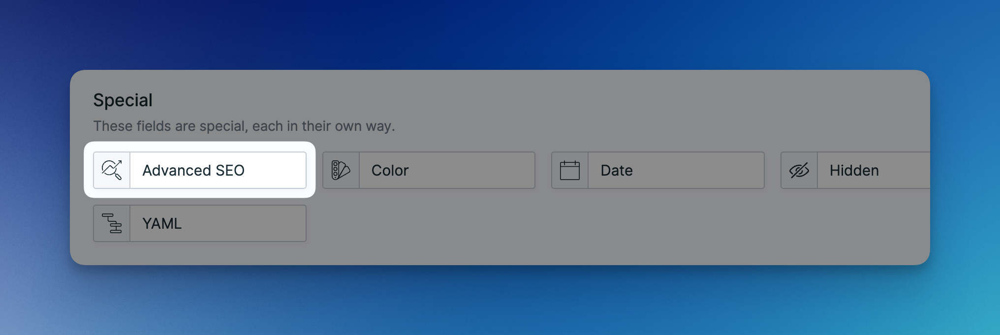

# Customizing Fields

This feature is useful if you only want to make a subset of fields available to be edited by your users. Or maybe you want to show different fields for different blueprints. Or maybe you want to add additional fields to the SEO Tab. All this is possible.

## Customizing Default Fields

Advanced SEO ships with a bunch of fieldsets that organize its fields by features. The **Advanced SEO (Main)** fieldset is the main file that bundles all other fieldsets together.

<figure><figcaption><p>An overview of all stock Advanced SEO fieldsets.</p></figcaption></figure>

To customize the fields that appear in the SEO tab of your entries and terms, simply edit the **Advanced SEO (Main)** fieldset. You may remove, add, and rearrange fields however you like. Changes made to this fieldset are applied globally to all of your entries and terms.

<figure><figcaption><p>Customizing the fields of the main Advanced SEO fieldset.</p></figcaption></figure>


Any SEO field that is removed from the blueprint will still be added as a hidden field. This is necessary to ensure the addon's functionality.


## Fully Custom Blueprint

Sometimes, editing the default fields just doesn't cut it. You might want to show certain fields in one blueprint but not in another. This is where the `Advanced SEO` fieldtype comes into play. Use this fieldtype to place any SEO field at any spot in your blueprint.


As soon as you add a custom SEO field to your blueprint, you are on your own. The SEO tab that is usually automatically added to the blueprint won't be added for you anymore.


<figure><figcaption><p>Choosing the Advanced SEO fieldtype in the blueprint builder.</p></figcaption></figure>

Select the SEO field you want to use in the `Field` dropdown. It is important that the `handle` of the `Advanced SEO` field is the same as the handle of the field you are choosing in the dropdown. Like in this example:

<div align="center"><figure><figcaption><p>Choosing the SEO field in the dropdown.</p></figcaption></figure></div>

```yaml
handle: seo_title
field:
  field: seo_title
  display: 'SEO Meta Title'
  type: advanced_seo
```

## Advanced Usage

Advanced SEO doesn't really care if you are using the `Advanced SEO` fieldtype or not. It will work with any field whose `handle` corresponds to one of its own fields.&#x20;

The only important thing to keep in mind is that the field you are using is augmenting to the same value that Advanced SEO expects. For example, you shouldn't use a bard field for the `seo_description` as Advanced SEO is expecting a textarea field.

Keeping this in mind you can do fun things like this:

```yaml
handle: seo_title
field:
  type: text
  display: 'SEO Title'
  visibility: computed
```

```php
Collection::computed('pages', 'seo_title', function ($entry) {
    return "{$entry->title} – {$entry->date}";
});
```
