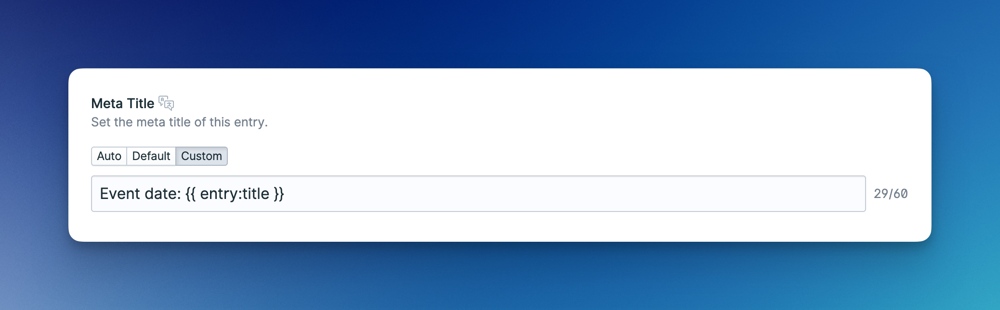

# On-Page SEO

## SEO Tab

Advanced SEO will add a `SEO` tab to the blueprints of your collections and taxonomies. This is where you will be able to edit all the SEO related settings of your entries and terms.

<figure><figcaption><p>The Advanced SEO tab that will show up when editing your entries and terms.</p></figcaption></figure>

## Field Sources

Each field will let you pick different sources for its value. The `Default` and `Custom` source is available to all fields, while the `Auto` source is only available to some fields like the `Meta Title`.

<figure><figcaption></figcaption></figure>

| Source    | Description                                                 |
| --------- | ----------------------------------------------------------- |
| `Auto`    | Inherits the value from a predefined field                  |
| `Default` | Inherits the value from the collection or taxonomy defaults |
| `Custom`  | A custom value unique to the entry or term                  |

## Variables

You may use variables in any `text`, `textarea`, and `code` field. You can either use `Antlers` or the `@field` syntax to add variables to your fields. Use whichever approach you like better.

### Antlers

Our beloved Antlers. Use it like you're used to. Bear in mind that Antlers won't work with GraphQL.

<figure><figcaption><p>Using Antlers to dynamically set the Meta Title of an entry.</p></figcaption></figure>

<figure><figcaption><p>Using Antlers to dynamically build the JSON-LD Schema of an entry.</p></figcaption></figure>

### @field Syntax

This syntax is an alternative to using Antlers that will also resolve the values when using GraphQL. It's straightforward to use: `@field:{field_handle}`. A few examples:

<figure><figcaption><p>Using the @field syntax to dynamically set the Meta Title of an entry.</p></figcaption></figure>

<figure><figcaption><p>Using the @field syntax to dynamically build the JSON-LD Schema of an entry.</p></figcaption></figure>

## Disabling Collections & Taxonomies

You may disable any collection or taxonomy by adding its handle to the disabled collections and taxonomies array in the config:

```php
'disabled' => [
    'collections' => ['people'],
    'taxonomies' => [],
],
```
