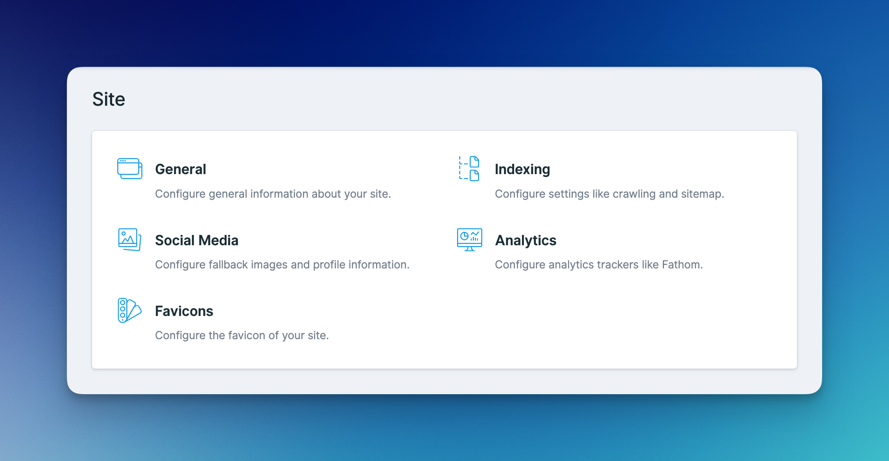
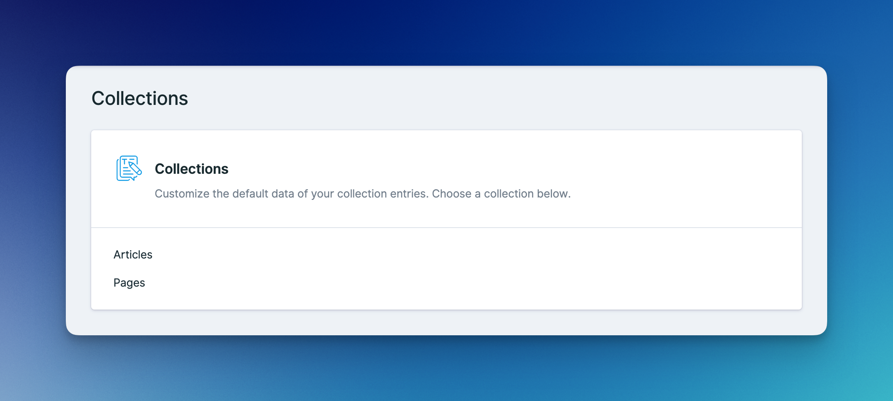
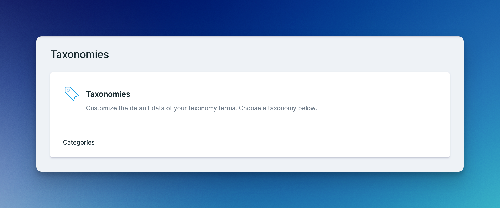

# Settings & Defaults


## SEO Navigation

Advanced SEO will add a `SEO` section to Statamic's sidebar navigation. This section is home to all the global settings and default values.

<figure><figcaption></figcaption></figure>

## Site

The site defaults consist of thoughtfully organized site-wide settings like the site name, indexing, social images, and analytics trackers.&#x20;

<figure><figcaption><p>The overview of the site defaults.</p></figcaption></figure>

## Collection & Taxonomy

The collection and taxonomy defaults let you define default values for your entries and terms like title, description, and social images.

<figure><figcaption><p>The overview of the collection defaults.</p></figcaption></figure>

<figure><figcaption><p>The overview of the taxonomy defaults.</p></figcaption></figure>

## Stache Store

You may configure the directory of the stache store by editing the path of the `directory` config:

```php
'directory' => base_path('content/seo'),
```
