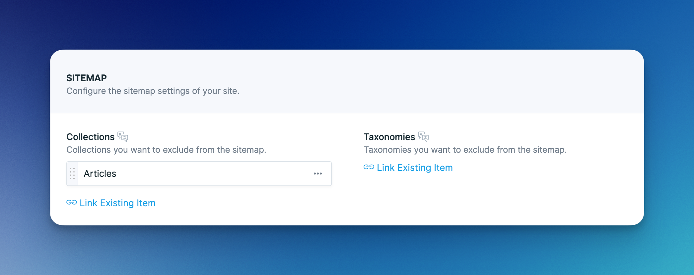

# Sitemaps

Advanced SEO generates sitemaps for all of your collections and taxonomies. The sitemaps are organized in a sitemap index, which can be accessed at `/sitemap.xml`.

## Generating sitemaps

Sitemaps are generated on demand whenever a sitemap is visited on the front end. If you have a content-heavy site, this might take a lot of resources and, in some cases, even result in a timeout.

To combat this issue, you may generate the sitemaps with the following command:

```php
php artisan seo:generate-sitemaps
```

Add the `--queue` flag to generate the sitemaps in the background:

```php
php artisan seo:generate-sitemaps --queue
```


Make sure that your current environment is [enabled for crawling](crawling.md). Else, you won't be able to generate the sitemaps.


The recommended way to go about generating your sitemaps is to [schedule the command](https://laravel.com/docs/master/scheduling#scheduling-artisan-commands):

```php
Schedule::command('seo:generate-sitemaps --queue')->hourly();
```

You may change the path where your generated sitemaps are saved in the config:

```php
'sitemap' => [
    'path' => storage_path('statamic/sitemaps'),
]
```

## Disable Sitemaps

You may globally disable the sitemap feature by setting `enabled` to `false` in the config:

```
'sitemap' => [
    'enabled' => false,
]
```

This will remove all the sitemap-related configs in the control panel and also remove the sitemap front end routes.

## Disabling Collections & Taxonomies

There are several ways to disable a collection or taxonomy from generating sitemaps.

### Disabled Collection or Taxonomy

Sitemaps won't be created for any collection or taxonomy that has been disabled in the config:

```php
'disabled' => [
    'collections' => ['people', 'subscriptions'],
    'taxonomies' => ['nations'],
],
```

### Excluded collections and taxonomies

Sitemaps won't be created for any collection or taxonomy that has been configured to be excluded from the sitemap in the Indexing site defaults:

<figure><figcaption></figcaption></figure>

### Enabled Noindex

Sitemaps won't be created if `Noindex` has been enabled in the Indexing site defaults:

<figure><figcaption></figcaption></figure>

## Excluding individual entries and terms

A couple of factors determine whether an individual entry or term will be excluded from the sitemaps.

### Disabled Sitemap

An entry or term will be excluded from the sitemap if the toggle is disabled:

<figure><figcaption></figcaption></figure>

### Enabled Noindex

An entry or term will be excluded from the sitemap if Noindex has been enabled:

<figure><figcaption></figcaption></figure>

### Canonical URL

An entry or term will be excluded from the sitemap if the canonical URL is anything else but `Current Entry` or `Current Term`. In the following example, the entry will be excluded from the sitemap:

<figure><figcaption></figcaption></figure>

## Custom Sitemaps

Custom sitemaps are a great tool to add any Statamic or Laravel route to Advanced SEO's sitemaps.

Use the `Sitemap::register()` method to register a custom sitemap in a service provider. The method expects a closure and needs to return a sitemap.

```php
use Aerni\AdvancedSeo\Facades\Sitemap;

Sitemap::register(function () {

    // Create a new sitemap URL.
    $signIn = Sitemap::makeUrl('https://statamic.com/sign-in');
    
    // You may also add optional attributes.
    $seller = Sitemap::makeUrl('https://statamic.com/seller')
        ->lastmod(now())
        ->changefreq('daily')
        ->priority('1.0')
        ->alternates([
            [
                'href' => 'https://statamic.com/seller',
                'hreflang' => 'en-EN',
            ],
            [
                'href' => 'https://statamic.com/de/seller',
                'hreflang' => 'de-DE',
            ],
        ]);
    
    // Create a sitemap and add the URLs to it.
    return Sitemap::make('user')
        ->add($signIn)
        ->add($seller);
        
});
```

You also have the option to move the sitemap-related code into its own class.&#x20;

```php
use Aerni\AdvancedSeo\Facades\Sitemap;
use App\Sitemaps\StatamicSitemap;

Sitemap::register(StatamicSitemap::class);
```

The sitemap class needs to extend the `BaseSitemap`  and implement the `urls()` method.

```php
namespace App\Sitemaps;

use Aerni\AdvancedSeo\Facades\Sitemap;
use Aerni\AdvancedSeo\Sitemaps\BaseSitemap;
use Illuminate\Support\Collection;
use Statamic\Facades\Entry;

class StatamicSitemap extends BaseSitemap
{
    public function urls(): Collection
    {
        $signIn = Sitemap::makeUrl('https://statamic.com/sign-in');   

        $seller = Sitemap::makeUrl('https://statamic.com/seller')
            ->lastmod(now())
            ->changefreq('daily')
            ->priority('1.0')
            ->alternates([
                [
                    'href' => 'https://statamic.com/seller',
                    'hreflang' => 'en-EN',
                ],
                [
                    'href' => 'https://statamic.com/de/seller',
                    'hreflang' => 'de-DE',
                ],
            ]);
            
        return collect()
            ->push($signIn)
            ->push($seller);
    }
}
```
