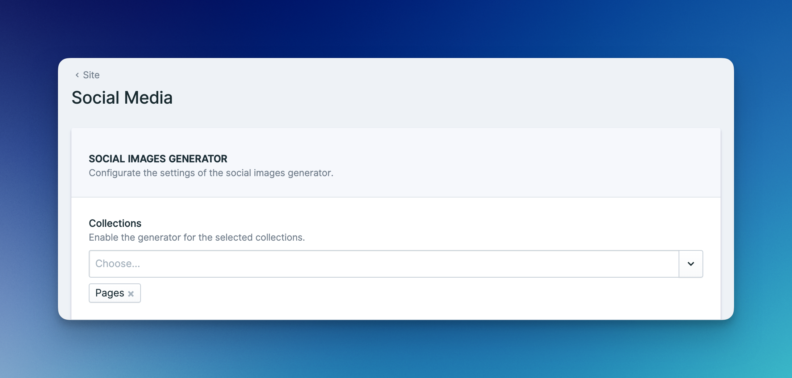
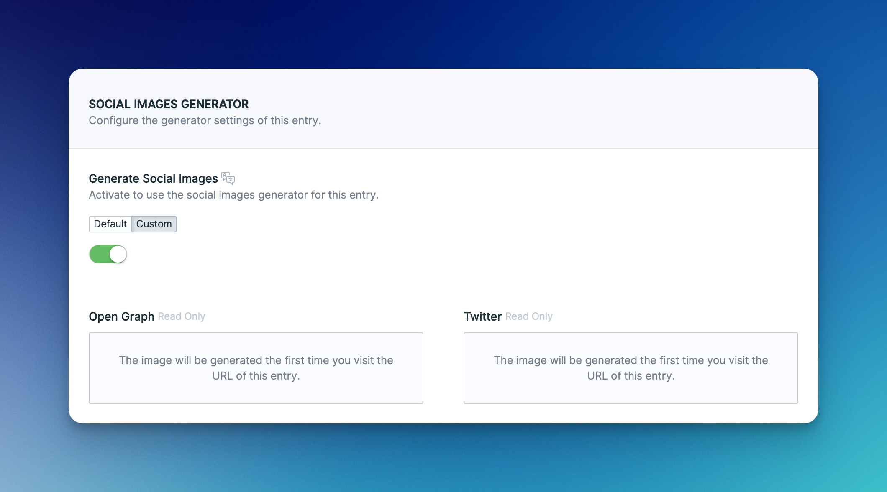
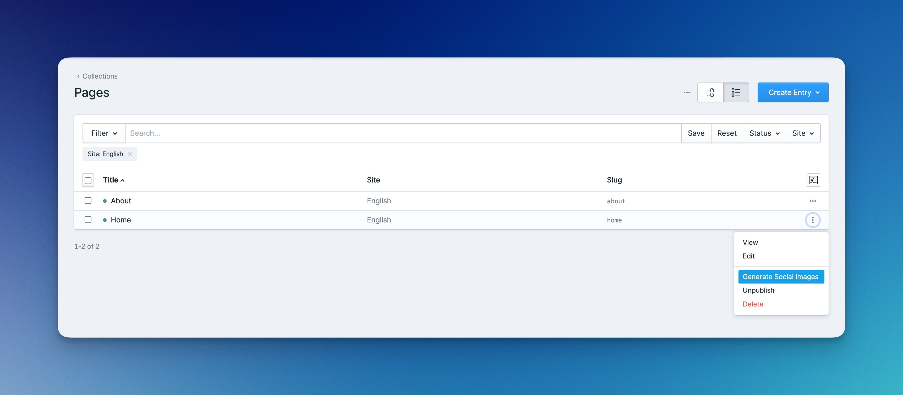

# Social Images Generator

## Requirements

The generator leverages [Browsershot](https://github.com/spatie/browsershot) and requires a working installation of [Puppeteer](https://github.com/puppeteer/puppeteer) on your server and local machine.

## Enable Generator

Enable the social images generator in the addon's config:

```php
'social_images' => [
    'generator' => [
        'enabled' => true,
    ],
],
```

Next, head over to the Social Media site defaults in the CP and enable the collections you want to generate images for:

<figure><figcaption></figcaption></figure>

This will add a Social Images Generator section to the SEO fields of each enabled collection:

<figure><figcaption></figcaption></figure>

## Generating Images

There are a couple of different ways to generate your social images. Choose whichever approach makes sense to you.

### On Save

By default, images are generated every time you save an entry.&#x20;

Generating images can be a time-consuming task. It's a good idea to use a queue driver like Redis to move the process into the background. You may configure the `queue` in the config:

```php
'social_images' => [
    'generator' => [
        'queue' => 'default',
    ],
],
```

### On-Demand

When an entry is saved, its previously generated social images are deleted. The new images are generated on-demand with the first request of the entry. Note that this will result in a slower response time on the first request.

To use this approach, set `generate_on_save` to `false` in the config:

```php
'social_images' => [
    'generator' => [
        'generate_on_save' => false,
    ],
],
```

### Action

You may also generate the images at any time using the action in the collection listing view:

<figure><figcaption></figcaption></figure>

### Command

Advanced SEO also provides a command to generate the social images of all entries at once. This can be useful when enabling the generator for an existing collection with many entries.

```bash
php please seo:generate-images
```

## Templating

You can design your images like a regular Statamic template, using the full power of Antlers like variables, tags, and partials.

### Themes

The generator is built around the concept of themes. You need at least one theme, but you can have as many as you’d like.

Run the following command to create your first theme:

```bash
php please seo:theme {name}
```

This will publish a default layout as well as a template for each social image type to `resources/views/social_images`.

If you created multiple themes, you will be able to select the theme of your choice in the `Theme` dropdown:

<figure><figcaption></figcaption></figure>


The type of Twitter image that will be generated is determined by the selected **Twitter Card**. Select **Regular** to generate the image using the  **`twitter_summary`** template or select **Large Image** to generate the images using the **`twitter_summary_large_image`** template.


### Preview

When building your templates, you most likely want to see what you’re doing. You can view your templates according to this pattern:

```
https://site.test/!/advanced-seo/social-images/{theme}/{type}/{id}
```

| Variable | Description              | Values                                                         |
| -------- | ------------------------ | -------------------------------------------------------------- |
| `theme`  | The theme to use         | e.g. `default` or `event`                                      |
| `type`   | The type of social image | `open-graph`, `twitter-summary`, `twitter-summary-large-image` |
| `id`     | The ID of the entry      | e.g. `4358df35-c7fe-4774-97ad-02af0e2dea3b`                    |

A couple of example:

```
https://site.test/!/advanced-seo/social-images/default/open-graph/4358df35-c7fe-4774-97ad-02af0e2dea3b
https://site.test/!/advanced-seo/social-images/default/twitter-summary/4358df35-c7fe-4774-97ad-02af0e2dea3b
https://site.test/!/advanced-seo/social-images/default/twitter-summary-large-image/4358df35-c7fe-4774-97ad-02af0e2dea3b
```

## Live Preview

You may use Statamic’s live preview feature to preview your social images when editing an entry. Simply click the `Live Preview` button and select the `Open Graph Image` or `Twitter Image` in the target dropdown.

<figure><figcaption></figcaption></figure>

## Asset Container

You may configure the asset container for your social images. The images will be saved into a `social_images` directory in the configured container.

```php
'social_images' => [
    'container' => 'assets',
],
```

## Presets

Social image sizes are constantly evolving. You may easily change the `width` and `height` of the generated images by editing the `presets` config:

```php
'social_images' => [
    'presets' => [
        'open_graph' => ['width' => 1200, 'height' => 628],
        'twitter_summary' => ['width' => 240, 'height' => 240],
        'twitter_summary_large_image' => ['width' => 1100, 'height' => 628],
    ],
]
```

## <br>
